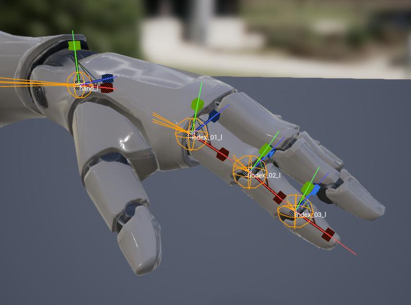
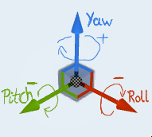
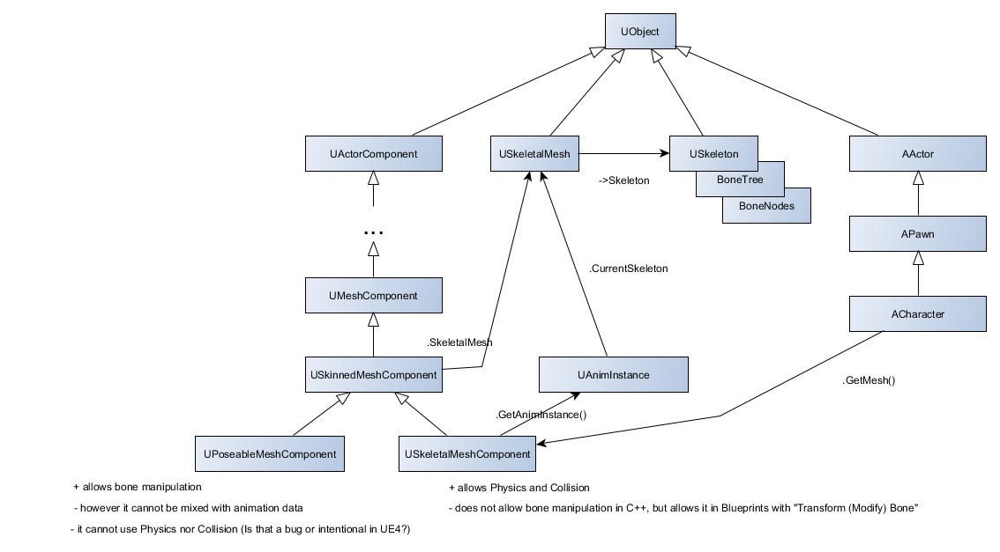

# DTrackPlugin Concepts & Dev-Notes

## Table of Contents
1. [About](#about)
2. [DTrack-Plugin Class-Architecture](#dtrack-plugin-class-architecture)
3. [Data-Buffer](#data-buffer)
4.  -> [Double-Buffering](#double-buffering)
5.  -> [Data-Structure](#data-structure)
6. [Space-Conversion](#space-conversion)
7.  -> [Rotations](#rotations)
8.  -> [Locations](#locations)
9. [Fingertracking](#fingertracking)
10. [Coordinate-System](#coordinate-system)
11. [Additional-Infos](#additional-infos)

## About

## DTrack-Plugin-Class-Architecture

The Class Architecture of the DTrack-Plugin, which controls an Actor, is mainly divided into three parts (from right to left):

* The `DTrackPollThread`'s task is to pick up DTrack data coming from the DTrack SDK, hence the A.R.T. track controller. It then Converts the DTrack-Space (mm, RHS) into Unreal's Space (cm, LHS) with the use of the FCoordinateConverter (SpaceConverter).
After this is done it places ("injects") the newly converted data into a data-buffer (see #Data-Buffer). In case of the quality being Zero (0), it doesn't convert or inject anything. Hence the PollThread is there to ease the game loop off being overloaded too much by doing that kind of processing. 

* The `FDTrackPlugin` itself, to `start_up` (register) or `remove` (unregister) clients (Actors) to be notified, to store the converted DTrack data received by the `DTrackPollThread` (see #Data-Buffer) and to forward that newly "injected" data coming from the `DTrackPollThread` to the `UDTrackComponent`.

* The `UDTrackComponent` attached to the Actor, that is being controlled, which enables the `FDTrackPlugin` to tick and does callback the corresponding handler of the Actor-Implemented `IDTrackInterface`-Method.


## Data-Buffer

To store the data coming from DTrack for the different Game-Actors to pick up<sup>1</sup>, there needs to be a shared memory between DTrackPollThread and the game itself.

### Double-Buffering

The DTrackPollThread does not write directly into the currently used data-buffer of the UDTrackComponent. It instead writes into a second data-buffer<sup>2</sup> (called: `m_injected`). This has the advantage that the Plugin can still process the data on the first data-buffer (here: m_front). Meanwhile the DTrackPollThread can inject its new data into the m_injected data-buffer.

To swap out the two buffers, so that the Plugin can use the new data, there has to be some form of mutual exclusion to avoid swapping of the buffers, while the m_front is still being used. To ensure this, there has been introduced a mutex on the data-buffers (here: swapping_mutex). Each time after the DTrackPollThread receives new data, converts it and injects it into the m_injected data-buffer, it tries to Lock access on the buffers by locking a mutex. It then can safely swap m_front and m_injected.

<sup>1</sup>   In reality the Actor does not pick up anything, whereas the DTrackComponent does a callback on the Actor's implemented IDTrackInterface-Method

<sup>2</sup>   There has been a bug, where targets not being visible made the connected object inside Unreal wiggle around. This bug got solved by not writing new data into the injected data-buffer.

### Data-Structure

To get an overview of how the data-structure of one of the data-buffers look like, see:


## Space-Conversion

### Rotations
For converting between spaces a similar concept from https://www.geometrictools.com/Documentation/ConvertingBetweenCoordinateSystems.pdf has been used.

To convert from right-handed coordinate system (DTrack) to left-handed coordinate system (Unreal-Engine 4).
This is done by flipping one axis direction, namely the z-axis (-Z).

### Locations
Also the units of DTrack and Unreal differ. In DTrack the unit of [cm] is used, whereas in Unreal the unit [mm] is used.


## Fingertracking

In the first section the differences between Unreal's Skeleton and DTrack's Skeleton will be shown. Afterwards there will be given some insight on what kind of conversion needs to be done to get to the Unreal Skeleton Coordinate system. In the last subsection you will get to see some of the challenges there are, because every Artist can choose different kind of Skeletons and Meshes.

### Differences between Unreal's and the DTrack's Hand-Skeleton

#### Right Hand


As one can see in the image above. The Unreal Mesh of the Right Hand has the positive X direction pointing to the base of the finger and Y-Axis pointing downwards. As this is a Left Handed Coordinate-System, the Z-Axis is pointing to the left.


You can see the DTrack model of a human right hand as depicted above.
It doesn't matter whether left or right hand the positive X-Axis is always orientated along the finger.
Here, for the back of the hand, the positive Z-Axis is pointing down. Whereas, for the phalanxes the positive Z-Axis is pointing upwards.

So that means to get from DTrack bone coordinate system to Unreal's you first need to apply a Rotation of -90° around Z-Axis (Yaw) and a Rotation of 90° around X-Axis (Roll). In Unreal-C++ this can be done by multiplying by right side with an FQuat(FRotator(0.f, -90.f, 90.f)). Afterwards you need to apply the quaternion of the bone FRotator but with swapped X and Y axes, for DTrack's `fingerTip` or in Unreal the `index_03_r` see the following C++-snippet:

```c++
// convert the DTrack handRoomRotation to the unreal adapted bone rotation of "hand_r"
FQuat handRoomRotationQuat = m_space_converter.from_dtrack_rotation(hand->rot).Quaternion();
			
// swaps the X with the Y axis, if the EDTrackCoordinateSystemType is CST_Unreal_Adapted
const FRotator convertedFingerTipRotator = m_space_converter.from_dtrack_rotation(hand->finger[j].rot); 

FQuat adaptedFingerTipQuat =
	handRoomRotationQuat * convertedFingerTipRotator.Quaternion()
	* FQuat(FRotator(0.f, -90.f, 90.f))	
	// rotate CCW 90 degrees around X (Roll) & rotate CCW 90 degrees around Z (Yaw)
;
```

#### Left Hand



Whereas, for the left hand Unreal uses a LHS coordinate system, where the X-Axis is pointing down along the finger (just like in DTrack), Y-Axis is pointing upwards and the Z-Axis is pointing to the left.


You can see the DTrack model of a human left hand as depicted above.
It doesn't matter whether left or right hand the positive X-Axis is always orientated along the finger.
Here, for the back of the hand, the positive Z-Axis is pointing always up. Whereas, for the phalanxes the positive Z-Axis is pointing upwards.

Here, to get from DTrack bone coordinate system to Unreal's you first need to apply a Rotation of 90° around Z-Axis (Yaw) and a Rotation of -90° around X-Axis (Roll). In Unreal-C++ this can be done by multiplying by right side with an FQuat(FRotator(0.f, -90.f, 90.f)). Afterwards you need to apply the quaternion of the bone FRotator but with swapped X and Y axes.

### Getting the Hand-Inner-Angle

Only problem is, that DTrack does not provide the angle between inner phalanx to backOfHand. These can be analytically calculated backwards as follows by doing following:

1. Converting the Fingertip into a Unreal-Rotation as mentioned in "Right Hand"
2. Transforming the Rotation (FRotator) into a quaternion (FQuat), which can be used to represent Rotations too, but without the problem of gimbal locks.
3. Setting up two quaternions (FQuat) for the Rotations between the bones, which are defined by the angles Gamma (middle_outer_phalanx_angle) and Beta (inner_middle_phalanx_angle) and an Axis of Rotation, which is retrieved by the quaternion in step #2
4. First apply the Quaternion from Step #2 and then apply the Quaternion from Step #3, this leads to a new Quaternion, representing the parent bone in the kinematic chain, until the Hand-Inner-Quaternion is reached.
5. The Hand-Inner-Quaternion can be converted into a FRotator where the three parts of it are the angles in degrees around the global axes.

For C++-Code, see following snippet for the right hand:

```c++
FQuat adaptedFingerTipQuat =
	handRoomRotationQuat * convertedFingerTipRotator.Quaternion()
	* FQuat(FRotator(0.f, -90.f, 90.f))	
	// rotate CCW 90 grad um X (Roll) & rotate CCW 90 grad um Z (Yaw)
;

const FRotator adaptedFingerTipRotator = adaptedFingerTipQuat.Rotator();
finger.m_rotation = adaptedFingerTipRotator;
 
// rotate the coordinate system into the right UE-Skeleton coord system:
const FQuat fingerTipOrientation(adaptedFingerTipRotator);
 
finger.m_middle_outer_phalanx_angle = hand->finger[j].anglephalanx[0];  // gamma
finger.m_inner_middle_phalanx_angle = hand->finger[j].anglephalanx[1];	// beta

// calucalte backwards (analitically, with quaternions):
const FQuat quatOuter  = fingerTipOrientation;

const FQuat rotationGammaQuat(quatOuter.GetUpVector(), -finger.m_middle_outer_phalanx_angle * DEG_TO_RAD);
const FQuat quatMiddle = rotationGammaQuat * quatOuter;		// first apply FQuat on right side then left

const FQuat rotationBetaQuat(quatMiddle.GetUpVector(), -finger.m_inner_middle_phalanx_angle * DEG_TO_RAD);
const FQuat quatInner  = rotationBetaQuat * quatMiddle;		// first apply FQuat on right side then left

////////////////////////////////////////////////////////////////////////
finger.m_middle_outer_phalanx_quater = quatOuter;	//  quatOuter
finger.m_inner_middle_phalanx_quater = quatMiddle;	//  quatMiddle
finger.m_hand_inner_phalanx_quater   = quatInner;	//  quatInner

////////////////////////////////////////////////////////////////////////
finger.m_middle_outer_phalanx_rotator = finger.m_middle_outer_phalanx_quater.Rotator();	// rotatorOuter
finger.m_inner_middle_phalanx_rotator = finger.m_inner_middle_phalanx_quater.Rotator();	// rotatorMiddle
finger.m_hand_inner_phalanx_rotator   = finger.m_hand_inner_phalanx_quater.Rotator();	// rotatorInner
```


### Approaches

#### Applying the DTrack provided angles to all the effectors in the kinematic chain

One approach -- which is used here -- is to get the different angles or rotations between the finger bones and apply them to the Unreal skeleton. 

A Disadvantage in this solution is, that in case your fingers don't have the lengths of the Unreal skeleton fingers, then your end-effector position may be off. Unless you apply the DTrack-calculated finger lengths to the Unreal skeleton ones, which will create a finger mesh being unproportional. So we don't want that.

#### Applying DTrack end effectors position & rotation and letting Unreal do the IK

Another approach is to use the DTrack position and rotation for the finger tips (the end effectors) and letting Unreal do the Inverse Kinematics (IK) calculations.

Every manufacturer can define their bone-lengths (hence the joint-locations) at their own demand. Also some artists can define their bones with offsets in their custom Skeleton. So an IK with the UE-Skeleton would be a good idea.


## Coordinate-System

The Coordinate System of Unreal -- as already mentioned -- is a left handed coordinate system. What is worth noting is, that the orientation of rotation is different for the X- and Y-Axis. If you place your left hand with the thumb pointing along where the arrow is pointing, then the others finger you are pointing to the positive rotation around that Axis, except for the X- and Y-Axis.

The following image shows the Coordinate System in Unreal and the corresponding orientation of rotation:




## How to change the Skeletal Bones in UE4 anyway?

When applying bones to the Skeleton of Unreal the question arises how the Skeletal Bones in any Skeletal Mesh of Unreal can be accessed (rotation and location) anyway. This can be done either by having the UPoseableMeshComponent or the USkeletalMeshComponent. Both have advantages and disadvantages I added to the image below, see:




## Additional-Infos

* https://wiki.beyondunreal.com/Quaternion
* 
