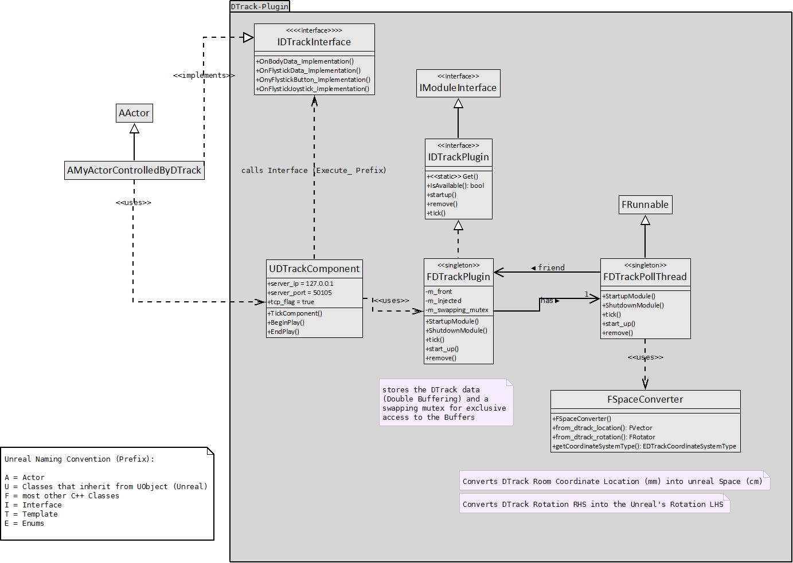

# DTrack-Plugin Class Architecture

The Class Architecture of the DTrack-Plugin is mainly divided into three parts. The Actor, the Plugin and a PollingThread.

* PollingThread: 
The Polling Threads task is to pick up DTrack data coming from the DTrack SDK, hence the A.R.T. track controller.
It then Converts the DTrack-Space (mm, RHS) into Unreal's Space (cm, LHS) with the use of the FCoordinateConverter (SpaceConverter).
After this is done it places the data into a buffer (described in section #ref Data-Buffer), unless the quality value is 0 (which means that the target is not visible anymore)

* Actor:
The Actor is just ticking  and therefore brings the Plugin to ticking
There can also be custom logic to do something when new converted DTrack data arrived inside the buffers.

* Plugin:
The Plugins responsibily is to store the converted DTrack data into a Data-Buffer
it does this using double-buffering. This has the advantage of low contention coming from the PollingThread locking the mutex on the buffer.

# Data-Buffer

To store the data coming from DTrack for the different Game-Actors to pick up, there needs to be a shared memory between DTrackPollingThread and the game itself.

To get a overview of how the structure looks like, see:

# Space Conversion

# Rotations
For converting between spaces a similar concept from https://www.geometrictools.com/Documentation/ConvertingBetweenCoordinateSystems.pdf has been used.

To convert from right-handed coordinate system (DTrack) to left-handed coordinate system (Unreal-Engine 4).
This is done by flipping one axis direction, namely the z-axis (-Z).

# Locations
Also the units of DTrack and Unreal differ. In DTrack the unit of [cm] is used, whereas in Unreal the unit [mm] is used.

# FINGERTRACKING

## Applying the DTrack provided angles to all the effectors in the kinematic chain

One approach is to get the different angles between the finger bones and apply them to the unreal skeleton. A Disadvantage in this solution is, that when your fingers don't have the lengths of the unreal skeleton fingers, then your end-effector position may be off (even though DTrack uses an IK-Method and statistics about fingers internally).

Only problem is, that DTrack does not provide the angle between inner phalanx to backOfHand. These can be calculated as follows:

`
FRotator rotatorFingerTip = m_coord_converter.from_dtrack_rotation(hand->finger[j].rot);
finger.m_rotation = FRotator(rotatorFingerTip);
FQuat fingerTipOrientation(finger.m_rotation);

finger.m_middle_outer_phalanx_angle = hand->finger[j].anglephalanx[0];  // gamma
finger.m_inner_middle_phalanx_angle = hand->finger[j].anglephalanx[1];	// beta

FQuat rotationGammaQuat(FVector::ForwardVector, -finger.m_middle_outer_phalanx_angle * DEG_TO_RAD); 
FQuat rotationBetaQuat(FVector::ForwardVector,  -finger.m_inner_middle_phalanx_angle * DEG_TO_RAD);

FQuat quatOuter = fingerTipOrientation;
FQuat quatMiddle = quatOuter  * rotationGammaQuat;		// first apply rotationGammaQuat and then quatOuter
FQuat quatInner  = quatMiddle * rotationBetaQuat;		// first apply rotationBetaQuat  and then quatMiddle

// add to proper UE4-rotation part: (is needed because forward is pointing to the negative side upwards the finger bones)
FRotator rotatorInner = quatInner.Rotator();
finger.m_hand_inner_phalanx_angle_pitch = -rotatorInner.Roll - 180.f;
finger.m_hand_inner_phalanx_angle_yaw = rotatorInner.Yaw - 180.f;
finger.m_hand_inner_phalanx_angle_roll = rotatorInner.Pitch; // should be zero (unchanged), because its not possible to do a finger twist.
`

The thumb is a challenge in itself, due to its initial default rotation in UE4. Therefore I added some offset -180.f to the angles in the base bone hand_inner_phalanx_angle.

## Applying DTrack end effectors position & rotation and letting unreal do the IK

Another approach is to use the DTrack position and rotation for the finger tips (the end effectors) and letting unreal do the Inverse Kinematics (IK) calculations.

Every manufacturer can define their bone-lengths (hence the joint-locations) at their own demand. Also some artists can define their bones with offsets in their custom Skeleton.
 
So a challenge here is, that in DTrack the fingerTip locations are relative to the back of the hand, whose coordinate system is placed where the index finger begins, as shown in the picture below:

But for Unreal that location is at the base of the hand. 

So to get the same location corresponding to the DTrack one in Unreal you need to know Unreal's offset from base to index finger. Following code does that:

`FVector relativeDBackOfHand = locationIndexFingerBase - locationBackOfHand;`
 
The position of the end effector (here: tip of the index finger) is calculate as following:

`FVector relativeDTipOfIndexFinger = relLocationOfFingerTip + relativeDBackOfHand;`

# Additional Infos:

https://wiki.beyondunreal.com/Quaternion

